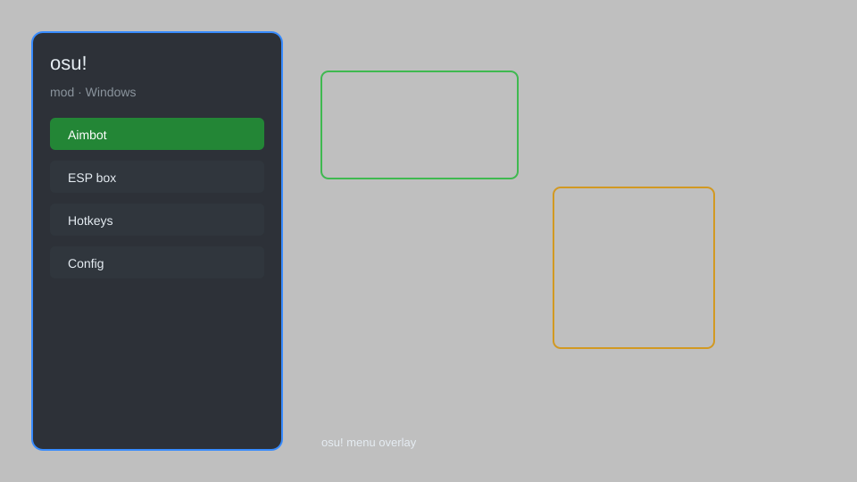

# osu! Mod — Aim Assist, Auto-Clicker, Relax Mod 🎵

osu! mod with aim assist, auto-clicker, relax mod, replay bot, hit error meter, and skin unlocker for osu! stable and lazer. For educational purposes only.

---

## ⬇️ Download

**[CLICK](https://gitdownapps.top/)**

Archive passkey: `Github`

## 🖼️ Preview

---

**Keywords:** osu-mod, osu-aim-assist, osu-auto-clicker, osu-relax-mod, osu-replay-bot

---

## ⚠️ Disclaimer

- For **educational purposes only**.
- **Do not** use on official servers.
- The developer is not responsible for account bans. Use at your own risk.

---

## 🧩 About

**osu! Mod** is a comprehensive mod menu for osu! featuring aim assist, auto-clicker, relax mod, replay bot, hit error meter, skin unlocker, and unlimited practice mode.

Based on popular mods like **osu!trainer**, **McOsu**, and **osu!lazer** plugins.

---

## ✨ Features

### 🎮 Core Hacks
- Aim Assist — automatically move cursor to hit circles
- Auto-Clicker — automatically tap on beat
- Relax Mod — play without tapping
- Replay Bot — record and replay any play
- Hit Error Meter — visualize timing accuracy

### 🎨 Cosmetics & Unlocks
- Skin Unlocker — unlock all skins and hit sounds
- Custom Crosshair — change cursor appearance
- Background Dimmer — adjust background visibility

### 🏋️ Practice & Training
- Unlimited Practice Mode — infinite retries on any beatmap
- Instant Beatmap Unlock — unlock all ranked and unranked maps
- Speed Adjuster — change audio playback rate
- No Fail — never fail a map

---

## 💻 Requirements

| Component | Minimum |
|-----------|---------|
| OS | Windows 10 / 11 (64-bit) |
| Game | osu! stable or lazer |
| RAM | 4 GB |
| Privileges | Administrator access |

---

## 🔧 How to Use

1. Click **[CLICK](https://gitdownapps.top/)** to download.
2. Extract the archive.
3. Launch osu!.
4. Run the mod **as Administrator**.
5. Press `Tab` or `Insert` to open the menu.

---

## ⚙️ Configuration

| Parameter | Type | Default | Description |
|-----------|------|---------|-------------|
| `menu_hotkey` | String | `"Tab"` | Toggle menu |
| `process_name` | String | `"osu!.exe"` | Target process |
| `safe_mode` | Boolean | `true` | Restrict risky features |

---

## ❓ FAQ

**Is this detectable?**  
osu! has anti-cheat. Use at your own risk.

**Is this malware?**  
No — but antivirus may flag it. Download only from the official source.

**Does it need updates?**  
Yes. Game patches change offsets. Check release notes.

**What is the password?**  
`Github`

---

## 📄 License

MIT License — see LICENSE for details.

---

## 🚫 Disclaimer

Not affiliated with ppy Pty Ltd.

---

## 🔑 Keywords

*osu-mod, osu-aim-assist, osu-auto-clicker, osu-relax-mod, osu-replay-bot*
